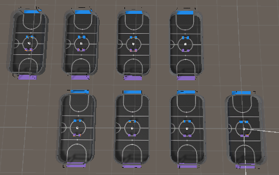
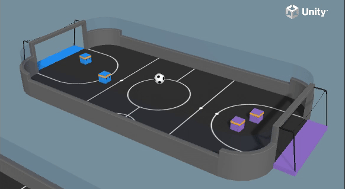

# SoccerTwo Unity Environment


A standalone Unity project for the SoccerTwo multi-agent reinforcement learning environment, supporting multiple reinforcement learning algorithms including SAC, PPO, and POCA for training intelligent soccer-playing agents.

## Environment Preview



*SoccerTwo environment with 4 agents (2 per team) competing in a soccer match*

## Requirements

- **Unity**: 6000.0 or later (tested with 6000.2.12f1)
- **ML-Agents Package**: com.unity.ml-agents v4.0.0 or later

## Installation

For detailed installation instructions, see [INSTALLATION.md](INSTALLATION.md)

### Quick Installation

### Step 1: Install Unity

1. Download and install [Unity Hub](https://unity.com/download)
2. Install Unity 6000.0 or later through Unity Hub

### Step 2: Install ML-Agents Package

You need to install the ML-Agents Unity package. Choose one of the following methods:

#### Method A: Install from Git URL (Recommended)

1. Open Unity and open this project
2. Go to `Window > Package Manager`
3. Click the `+` button > `Add package from git URL...`
4. Enter: `https://github.com/Unity-Technologies/ml-agents.git?path=/com.unity.ml-agents`
5. Click `Add`

#### Method B: Install from Local Package

1. Clone the ML-Agents repository:
   ```bash
   git clone https://github.com/Unity-Technologies/ml-agents.git
   ```
2. In Unity, go to `Window > Package Manager`
3. Click the `+` button > `Add package from disk...`
4. Navigate to `ml-agents/com.unity.ml-agents/package.json`
5. Click `Open`

#### Method C: Download and Install Unity Package

1. Download the latest ML-Agents release from [GitHub Releases](https://github.com/Unity-Technologies/ml-agents/releases)
2. Extract the `com.unity.ml-agents` folder
3. Follow Method B steps 2-5

### Step 3: Install Required Unity Packages

The following packages should be installed automatically via `manifest.json`:
- Unity AI Navigation
- Unity Input System
- Unity Recorder
- Unity UGUI

If any packages are missing, Unity will prompt you to install them.

### Step 4: Verify Installation

1. Open the scene: `Assets/SoccerTwo/Scenes/SoccerTwos.unity`
2. Check the Console for any errors
3. If you see ML-Agents related errors, ensure the package is properly installed

## Project Structure

```
Assets/
├── SoccerTwo/           # Soccer environment files
│   ├── Scripts/        # Agent and environment scripts
│   ├── Prefabs/        # Soccer field and agent prefabs
│   ├── Scenes/         # Unity scenes
│   ├── Materials/      # Soccer materials and textures
│   └── Meshes/         # 3D models
└── SharedAssets/       # Shared resources (AgentCube prefabs)
```

## Training

### Prerequisites

To train agents, you'll need:

1. **Python 3.10.1-3.10.12** (recommended: 3.10.12)
   - Download from [Python.org](https://www.python.org/downloads/)
   - Verify installation: `python --version`

2. **ML-Agents Python packages**:
   ```bash
   pip install mlagents
   ```

3. **Optional**: For better performance, install PyTorch with CUDA support (if you have an NVIDIA GPU)

See the [ML-Agents Installation Guide](https://github.com/Unity-Technologies/ml-agents/blob/main/docs/Installation.md) for details.

### Training Process

#### Step 1: Prepare Configuration

Choose a training algorithm and configuration file:

- **SAC (Soft Actor-Critic)**: `config/sac/SoccerTwos.yaml`
- **POCA (Policy Optimization with Coordinated Agents)**: `config/poca/SoccerTwos.yaml`

You can modify hyperparameters in these YAML files according to your needs.

#### Step 2: Start Training

1. **Build the Unity environment** (for faster training):
   - In Unity, go to `File > Build Settings`
   - Select your platform (Linux recommended for servers)
   - Click `Build` and save the executable

2. **Start training with ML-Agents**:

   **Using built executable:**
   ```bash
   mlagents-learn config/sac/SoccerTwos.yaml --env=path/to/your/build/SoccerTwo.exe --run-id=soccer_sac_run1
   ```

   **Using Unity Editor** (slower but easier for development):
   ```bash
   mlagents-learn config/sac/SoccerTwos.yaml --run-id=soccer_sac_run1
   ```
   Then press `Play` in Unity Editor when prompted.

#### Step 3: Monitor Training

- Training metrics will be displayed in the terminal
- TensorBoard can be used for visualization:
  ```bash
  tensorboard --logdir=results
  ```
- Checkpoint models are saved in `results/<run-id>/SoccerTwos/`
- Best models are saved automatically based on performance

**Example Training Results:**


*Policy playout results showing winning rate against each other*

#### Step 4: Export Trained Model

After training, export the ONNX model for inference:

```bash
mlagents-learn config/sac/SoccerTwos.yaml --run-id=soccer_sac_run1 --resume
```

The model will be saved as an ONNX file that can be loaded in Unity for inference.

### Training Tips

- **Start with default hyperparameters**: The provided configs are tuned for good performance
- **Monitor training curves**: Watch for reward convergence and adjust learning rates if needed
- **Use self-play**: The configs include self-play settings for robust training
- **Checkpoint management**: Models are saved periodically, so you can resume training if interrupted

## Configuration

Training configuration files are provided in the `config/` directory:
- `config/sac/SoccerTwos.yaml` - SAC trainer configuration
- `config/poca/SoccerTwos.yaml` - POCA trainer configuration

These configs include:
- Hyperparameters (learning rates, batch sizes, etc.)
- Network architecture settings
- Self-play configuration with ELO ratings
- Reward signal settings

## Switching Policies

This project supports multiple training algorithms (SAC, PPO, POCA) and allows you to switch between different trained policies for inference.

### Method 1: Using Unity Inspector (Recommended)

1. Open the scene: `Assets/SoccerTwo/Scenes/SoccerTwos.unity`
2. Select an agent GameObject in the hierarchy
3. Find the **Behavior Parameters** component
4. Configure the policy:
   - **Behavior Name**: Should match the behavior name from your training config (e.g., `SoccerTwos`)
   - **Model**: Drag and drop your trained `.onnx` model file
     - SAC models: `Assets/SoccerTwo/Models/sac/SoccerTwos.onnx`
     - POCA models: `Assets/SoccerTwo/Models/poca/SoccerTwos.onnx`
     - PPO models: `Assets/SoccerTwo/Models/ppo/SoccerTwos.onnx`
   - **Inference Device**: Choose `CPU` or `GPU` (if available)

### Method 2: Automatic Policy Detection

The agent automatically detects the policy type from the BehaviorName:
- Behavior names containing "sac" or "soft" → Uses SAC policy with complex rewards
- Behavior names containing "ppo" or "proximal" → Uses PPO policy
- Behavior names containing "poca" or "coord" → Uses POCA policy

You can also manually configure the policy in the **Agent Soccer** component:
- **Auto Detect Policy**: Enable/disable automatic detection
- **Policy Config**: Manually set the policy type and reward configuration

### Method 3: Programmatic Model Loading

You can also load models at runtime using Unity ML-Agents API. The agents will automatically detect and use the appropriate policy based on the model's behavior name.

### Loading Pre-trained Models

1. Place your trained `.onnx` model file in:
   - `Assets/SoccerTwo/Models/sac/` for SAC models
   - `Assets/SoccerTwo/Models/poca/` for POCA models
   - `Assets/SoccerTwo/Models/ppo/` for PPO models

2. Assign the model to agent Behavior Parameters as described in Method 1

3. Set the agent to **Inference** mode (not training)

4. Press Play to see your trained agents in action!

### Policy-Specific Features

- **SAC**: Uses complex reward shaping with dense rewards for ball possession, goal proximity, etc.
- **POCA**: Uses group rewards for coordinated team play
- **PPO**: Uses individual rewards with standard policy gradient updates

### Algorithm Demonstrations

Watch trained agents in action with different algorithms:

#### SAC (Soft Actor-Critic)


*SAC agents demonstrating coordinated ball control and strategic gameplay*

#### POCA (Policy Optimization with Coordinated Agents)


*POCA agents showing team coordination and collaborative strategies*

#### PPO (Proximal Policy Optimization)


*PPO agents exhibiting robust policy execution*

## Features

- Support for multiple training algorithms (SAC, PPO, POCA)
- Automatic policy detection from BehaviorName
- Complex reward shaping for SAC
- Self-play support with ELO rating
- Multi-agent coordination
- ONNX model inference support
- GPU/CPU inference device selection


*Agent architecture and observation space*

## Troubleshooting

### Package Installation Issues

If the ML-Agents package doesn't install correctly:
1. Check Unity version (must be 6000.0+)
2. Verify internet connection (for Git URL method)
3. Check Unity Package Manager logs: `Window > Package Manager > (icon) > Show log file`

### Missing Scripts Error

If you see "Missing Script" errors:
1. Ensure ML-Agents package is installed
2. Reimport scripts: Right-click `Assets/SoccerTwo/Scripts` > `Reimport All`

### Scene Errors

If the scene won't load:
1. Check that all prefabs are present
2. Verify tags are set correctly (ball, blueGoal, purpleGoal)
3. Check Console for specific error messages

## Citations

If you use this project in your research, please cite the following works:

### Policy Gradient Methods
- **An ML Agent using the Policy Gradient Method to win a SoccerTwos Game**
  - Link: https://www.scitepress.org/Papers/2022/111084/111084.pdf
  - Citation:
    ```
    @inproceedings{ml_agent_soccer_2022,
      title={An ML Agent using the Policy Gradient Method to win a SoccerTwos Game},
      year={2022},
      publisher={SCITEPRESS},
      url={https://www.scitepress.org/Papers/2022/111084/111084.pdf}
    }
    ```

### Reward Engineering
- **Comprehensive Overview of Reward Engineering and Shaping in Advancing Reinforcement Learning Applications**
  - Link: https://arxiv.org/html/2408.10215v1
  - Citation:
    ```
    @article{reward_engineering_2024,
      title={Comprehensive Overview of Reward Engineering and Shaping in Advancing Reinforcement Learning Applications},
      year={2024},
      journal={arXiv preprint arXiv:2408.10215},
      url={https://arxiv.org/html/2408.10215v1}
    }
    ```

### Multi-Agent Soft Actor-Critic
- **Multi-Agent Soft Actor-Critic with Coordinated Loss for Autonomous Mobility-on-Demand Fleet Control**
  - Link: https://arxiv.org/pdf/2404.06975
  - Citation:
    ```
    @article{multi_agent_sac_2024,
      title={Multi-Agent Soft Actor-Critic with Coordinated Loss for Autonomous Mobility-on-Demand Fleet Control},
      year={2024},
      journal={arXiv preprint arXiv:2404.06975},
      url={https://arxiv.org/pdf/2404.06975}
    }
    ```

### Unity ML-Agents
- **Unity ML-Agents Toolkit**
  - Repository: https://github.com/Unity-Technologies/ml-agents
  - Citation:
    ```
    @software{mlagents2020,
      title={Unity ML-Agents Toolkit},
      author={Juliani, Arthur and Berges, Vincent-Pierre and Teng, Ervin and Cohen, Andrew and Harper, Jonathan and Elion, Chris and Goy, Chris and Gao, Yuan and Henry, Hunter and Mattar, Marwan and Lange, Danny},
      year={2020},
      url={https://github.com/Unity-Technologies/ml-agents}
    }
    ```

## License


ML Agents copyright © 2017 Unity Technologies

Licensed under the Apache License, Version 2.0 (the "License");
you may not use this file except in compliance with the License.
You may obtain a copy of the License at

    http://www.apache.org/licenses/LICENSE-2.0

Unless required by applicable law or agreed to in writing, software
distributed under the License is distributed on an "AS IS" BASIS,
WITHOUT WARRANTIES OR CONDITIONS OF ANY KIND, either express or implied.
See the License for the specific language governing permissions and
limitations under the License.

For full license details, see [LICENSE.md](LICENSE.md).

### Third-Party Licenses

This project includes third-party software components that are governed by their own licenses. Some components use the MIT License, while others use the Apache License 2.0. For a complete list of third-party components and their licenses, please see [Third Party Notices.md](Third%20Party%20Notices.md).

**Third-party components using MIT License:**
- System.Buffers.dll
- System.Numerics.Vectors.dll
- System.Runtime.CompilerServices.Unsafe
- System.Memory.dll
- System.IO.Abstractions

**Third-party components using Apache License 2.0:**
- System.Interactive.Async.dll
- Grpc

## Credits

Based on Unity ML-Agents SoccerTwos environment. This standalone version includes enhancements for multi-algorithm support (SAC, PPO, POCA) and improved reward shaping mechanisms.
